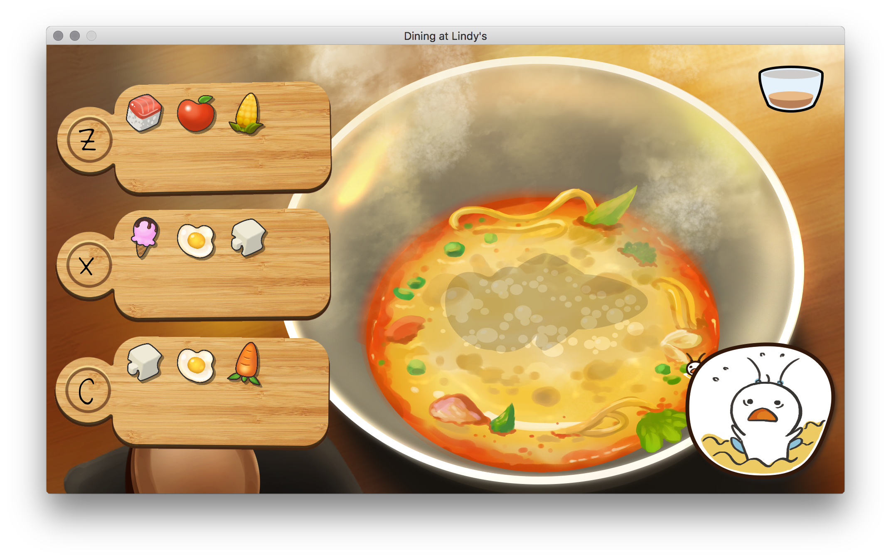

# Dining at Lindy's

*Open Jam Aotearoa 2018 entry*

## Instructions

Download LÖVE [here](https://love2d.org/) to play the game. Once LÖVE is installed, run the "dining_at_lindys.love" file.

Save Mr. Yum by matching the correct ingredients board with the submerged silhouette (soupberg).  
There is a **Z** / **X** / **C** on each board -- you simply press the corresponding key for your selection.

## About

"A number of 'Waiter ...' jokes are attributed to the notoriously rude waiters at Lindy's Restaurant in New York. Lindy's was started in August 1921 by Leo Lindemann and was as famous for the backchat of its waiters as for its clientele of comics, gangsters, show-biz stars and other celebrities."

In this game, your job is to save Mr. Yum (or, Tom, to his friends) from drowning in your soup. By solving a series of puzzles, you'll be rewarded with a top-up in your soup bowl. Once the soup reaches the brim, Mr. Yum can reach for the edge and climb out.

Artist: [Mary Guo](https://www.maryguo.com/)

Made with [LÖVE](https://love2d.org/) <3  
Fonts: Cute Font by Paula Tennet; Quicksand be Andrew Paglinawan  
Libraries: tween.lua & anim8.lua by kikito

[Open Jam Aotearoa](https://openjam.cmp.ac.nz/) 2018 entry  
(Game Jam theme: "soup")

## To-Do

* It's a game jam effort ... it'll do
